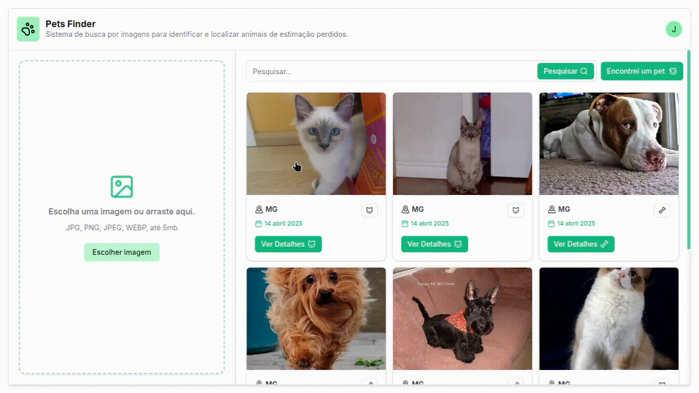

# 🐾 PETS FINDER

Pets Finder uses embedding models to match images and textual descriptions of pets. Whether you're looking for a lost pet or trying to help someone reunite with theirs.

Upload a photo or a description, and the system will search for similar entries to help you find potential matches.

## 📸 Demo



## 🚀 Tech Stack

-   Java (Spring Boot) – RESTful API backend
-   Python with Embedding Models (CLIP)
-   React.js for client-side
-   PostgreSQL
-   Docker & Docker Compose
-   Qdrant – Vector database for fast similarity search
-   RabbitMQ – Message queue for asynchronous tasks
-   Redis – In-memory cache
-   Kong – API Gateway

# 🛠️ Installation

-   Configure the PostgreSQL variables in the `docker-compose.yml`
-   Configure the `/embedding-server/.env` and the `/api/src/main/resources/application.properties`

`.env` for the **embedding-server**:

```
AWS_ACCESS_KEY=...
AWS_SECRET_KEY=...
AWS_REGION=...
AWS_S3_BUCKET=...

GOOGLE_API_KEY=...
LOCAL_IMAGES_URL=...
STORAGE_TYPE=local || s3
```

-   "`LOCAL_IMAGES_URL`" means that you can choose between storing the images on local storage or Amazon S3
-   "`GOOGLE_API_KEY`" will be used for **Gemini**

---

`application.properties` for the **api**:

```
jwt.private.key=classpath:app.key
jwt.public.key=classpath:app.pub

app.files.folder=/app/data

aws.access.key=...
aws.secret.key=...
aws.region=...
aws.s3.bucket=...

cors.urls=...
```

-   `jwt.private.key` and `jwt.public.key` point to the RSA keys used for authentication via JWT.

    ```
        cd ./api/src/main/resources

        openssl genrsa -out app.key
        openssl rsa -in app.key -pubout -out app.pub
    ```

-   `app.files.folder` sets the local path where uploaded files will be stored if not using S3.
-   The AWS section configures integration with Amazon S3 (if `STORAGE_TYPE` is set to `s3`).
-   `cors.urls` should list allowed domains for CORS requests (comma-separated).
-   It's also needed the configuration for Redis, Postgres and RabbitMQ.

---

### Build and run the stack:

```bash
docker-compose up --build
```

This will spin up all necessary services: API, embedding server, Postgres, Redis, RabbitMQ, Qdrant, and Kong Gateway.

## Installing the React Client

The frontend client is built using **Vite** + **React**.

1. **Navigate to the client folder**:

    ```bash
    cd client
    ```

2. **Create a `.env` file**:

    ```env
    VITE_API_URL=http://localhost:8800
    VITE_IMAGES_URL=CDN url, or S3 Bucket or Local Storage URL
    ```

    - `VITE_API_URL` is the base URL exposed by Kong Gateway (or your public API).
    - `VITE_IMAGES_URL` points to either your CDN/S3 bucket or local static image hosting (served by the API or a static server).

3. **Install dependencies and start the app**:

    ```bash
    npm install
    npm run dev
    ```

    The app will be available at [http://localhost:5173](http://localhost:5173).
